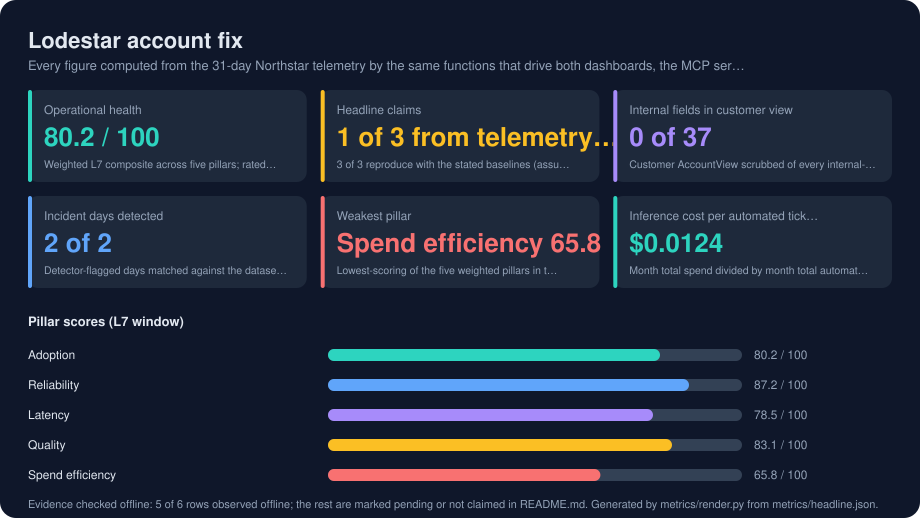
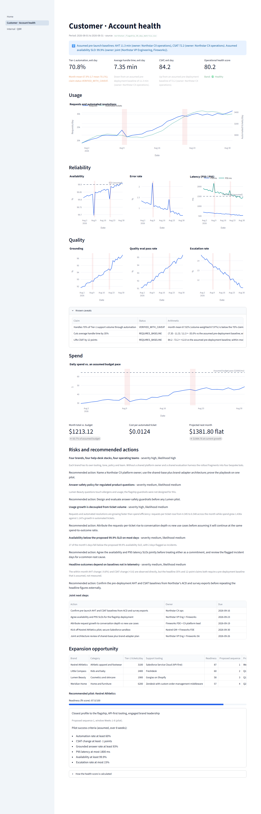
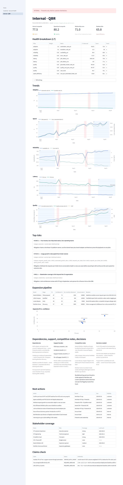

# Lodestar

**Account-health instrumentation for an AI support deployment: one core computes every number once, and two audience-scoped dashboards, an MCP server, a JSON API and an executive-brief generator all read from it, so the internal team, the customer's leadership and the executive brief tell one story from one telemetry file, and nothing internal reaches the customer by construction.**

Built for the Fireworks AI take-home ("Northstar Retail Group: EBR, Internal QBR & Account Health"): one 31-day telemetry file for a fine-tuned customer-support deployment, three audiences, three coordinated deliverables.

> **Source code is private.** This public repository carries the README, the measured results card, screenshots of both dashboards, the design documents, the executive brief, the assumptions register and the delivery evidence. The full repository (Python package, Streamlit app, MCP server, API, 251 tests, one check gate, CI) lives in a private repository and is shared with reviewers on request: roshan.s.rana@gmail.com.

## At a glance

| | |
|---|---|
| **The problem** | Three audiences need the same evidence told three ways: a candid internal QBR, a polished customer account-health view, and an executive brief with a credible expansion case. Every figure has to agree, and internal judgement must never leak to the customer. |
| **What it does** | A transparent five-pillar health score with published floors, targets and weights; a headline-claim checker that separates what telemetry proves from what needs a baseline; rolling-threshold incident detection; an audience-tagged risk register; a four-brand expansion model that ranks the pilot; an EBR generator on Fireworks (OpenAI-compatible) or Anthropic behind a leak guard, deterministic offline by default. |
| **Stack** | Python 3.12, `uv`, Streamlit + Plotly, FastAPI, the `mcp` Python SDK, python-docx, httpx, pydantic v2, Typer plug-in CLI. No pandas, no database, no Docker. |
| **Validation** | One gate: ruff, mypy strict (host and Linux target), pytest with an 80% floor (251 tests, 97% coverage), secrets scan, deterministic bench, README card drift check. CI runs the same gate. |

<!-- metrics:start -->

## Results

Every figure below was observed by the offline bench in the private source repository (fixed seed, no API key) and written to `metrics/headline.json`, which is committed here. Every figure computed from the 31-day Northstar telemetry by the same functions that drive both dashboards, the MCP server and the EBR. Rows marked *pending* need hardware, data or a service the offline harness does not have; nothing here is estimated.

| Metric | Value | How it was measured |
|---|---|---|
| Operational health | **80.2 / 100** | Weighted L7 composite across five pillars; rated healthy. |
| Headline claims | **1 of 3 from telemetry alone** | 3 of 3 reproduce with the stated baselines (assumed, owner Northstar CX ops) |
| Internal fields in customer view | **0 of 37** | Customer AccountView scrubbed of every internal-tagged field before it leaves AccountView.build. |
| Incident days detected | **2 of 2** | Detector-flagged days matched against the dataset's own incident annotations. |
| Weakest pillar | **Spend efficiency 65.8** | Lowest-scoring of the five weighted pillars in the operational composite. |
| Inference cost per automated ticket | **$0.0124** | Month total spend divided by month total automated Tier-1 tickets. |

**Pillar scores (L7 window)**

| | | |
|---|---|---|
| Adoption | `████████████████░░░░` | 80.2 / 100 |
| Reliability | `█████████████████░░░` | 87.2 / 100 |
| Latency | `████████████████░░░░` | 78.5 / 100 |
| Quality | `█████████████████░░░` | 83.1 / 100 |
| Spend efficiency | `█████████████░░░░░░░` | 65.8 / 100 |

**Evidence checked offline**

| | Status | Evidence |
|---|---|---|
| MCP tools exercised | observed | 6 of 6 |
| API routes | observed | 6 of 6 |
| EBR sections present | observed | 8 of 8 |
| Days below proposed SLO | observed | 27 of 31 at 99.9% |
| Request vs automated growth | observed | requests ×1.45 vs automated tickets ×1.15 (L7/F7) |
| Live provider narrative | pending | not run offline |

<!-- metrics:end -->

## The two views

**Customer · Account health** (for Northstar's VP Customer Experience and VP Engineering): outcome tiles with their assumed-baseline caveats, the operational health score, usage and reliability trends with incident shading, quality trends, spend against budget, customer-visible risks and joint next steps, and the expansion opportunity. Zero internal fields reach this view; the bench measures it.

**Internal · QBR** (Fireworks account, engineering and leadership): internal composite with a relationship pillar, health breakdown with methodology, five trend charts, top-3 risks with evidence, expansion pipeline with confidence and blockers, dependencies, support burden, competitive notes, decisions needed, next actions with owners and dates, stakeholder coverage.

## How audience separation is enforced

Every model field carries a visibility tag that fails closed (untagged means internal). One `scrub()` function drops internal fields for the customer audience, and the customer page, the JSON API, the six MCP tools and the EBR generator can only receive the scrubbed view. A recursive leak test walks every model reachable from the account view; the bench publishes the count (0 of 37 internal field definitions populated in the customer view) and CI fails if it changes. Model prose passes a deny-list guard for internal terms and internal figures before it is used, with an offline fallback. Residual risk, paraphrase, is disclosed in the threat model.

## The health score, in one paragraph

Last-7-day window scored against the first 7 days as trend reference. Each metric scores 0–100 by linear interpolation between a published floor and target; pillars average their metrics; the operational composite is the weighted sum (reliability 0.25, quality 0.25, adoption 0.20, latency 0.15, spend efficiency 0.15). Bands: healthy ≥ 80, watch 65–79.99, at risk < 65. On the shipped telemetry: 80.2, healthy, with spend efficiency the weakest pillar at 65.8. The full table and worked arithmetic are in [`docs/design-document.md`](docs/design-document.md#how-the-account-health-score-is-calculated).

## What is in this repository

| Path | What |
|---|---|
| [`docs/design-document.md`](docs/design-document.md) | Screenshots, audience and purpose of each view, metric choices, health-score arithmetic, internal vs customer differences, exclusions, trade-offs |
| [`docs/ebr/northstar-ebr-brief.md`](docs/ebr/northstar-ebr-brief.md) · [`.docx`](docs/ebr/northstar-ebr-brief.docx) | Executive Business Review: narrative, metric context, expansion recommendation, scaling architecture, pilot, budget and timeline, talking points, biggest risk |
| [`docs/ASSUMPTIONS.md`](docs/ASSUMPTIONS.md) | Every assumption with value, basis, owner and where it surfaces |
| [`docs/OVERVIEW.md`](docs/OVERVIEW.md) · [`docs/SHOWCASE.md`](docs/SHOWCASE.md) | What it is and why; a guided tour with the commands (runnable against the private source) |
| [`docs/design/`](docs/design/) | Problem brief, requirements, HLD, threat model, LLD with frozen contracts, execution plan, ADRs |
| [`docs/tasks/`](docs/tasks/) | 14 task packs, each with an independent verifier's verdict |
| [`docs/evidence/ledger.jsonl`](docs/evidence/ledger.jsonl) | Hash-chained gate and task evidence (25 entries) |
| [`docs/security-review.md`](docs/security-review.md) · [`docs/ship-report.md`](docs/ship-report.md) | Controls C-01..C-17 with evidence and live probes; what shipped, what was measured, what was not run |
| [`docs/graph/README.md`](docs/graph/README.md) | The code knowledge graph agents query instead of grepping, with three real queries |
| [`metrics/headline.json`](metrics/headline.json) | The observed figures the results card is rendered from |
| [`data/`](data/) | The three YAML context files (assumptions, brand profiles, account context); brand and relationship data are fictional and labelled as such |

## How it was built

Under a gated delivery lifecycle: design documents frozen before code, one task pack per change, every task implemented by one model context and verified by a fresh one in an isolated git worktree, a hash-chained evidence ledger, a security review with live probes, and a retrospective ADR. Design and orchestration ran on a frontier model; all implementation and verification ran on Sonnet-class models. No task needed a second attempt.

## License

MIT. Brand profiles and account context are fictional; the telemetry was supplied with the exercise.
