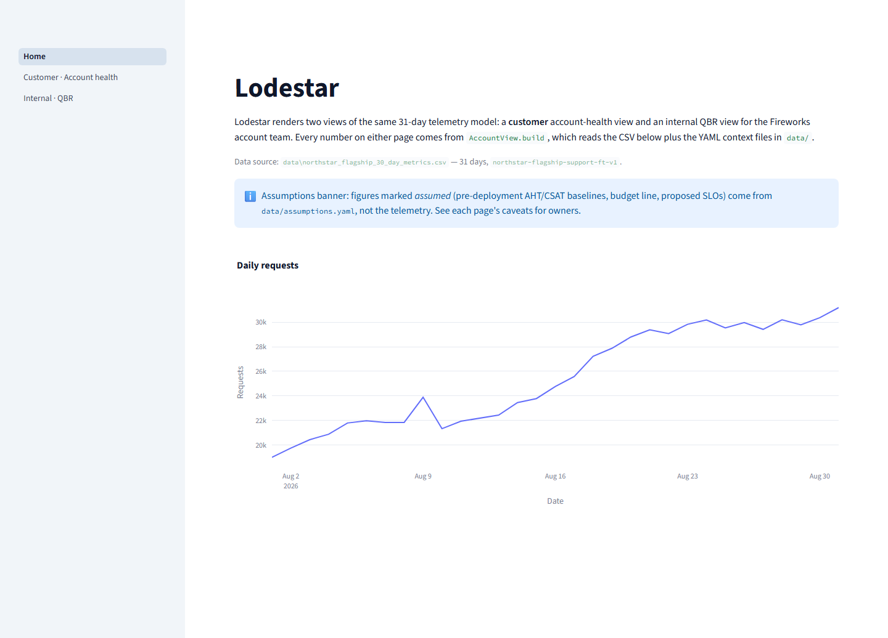

# Design document — Lodestar

This document answers every bullet of the take-home prompt's submission item 3. Every figure
below comes from `metrics/headline.json`, `docs/design/03-lld.md`, or `docs/ebr/northstar-ebr-brief.md` —
none is invented for this document.

## Landing page



The landing page explains the two views below, names the data source (`data/northstar_flagship_30_day_metrics.csv`)
and shows the assumptions banner before either view is opened.

## Screenshots — internal QBR


The internal page (`app/pages/internal_qbr.py`) opens with a red "INTERNAL — Fireworks only. Not
for customer distribution." banner, then: the internal composite and its band, the operational
composite, the relationship score, and the weakest pillar as tiles; a health breakdown table with
trend arrows and a methodology expander; five trend charts (adoption, spend, reliability, latency,
quality) with incident shading and first-week/last-week shading; the top-3 risk cards with
evidence and mitigation; the expansion pipeline table (stage, fit, confidence, estimated monthly
inference, annual value, blockers, target date, owner) with a fit-versus-confidence scatter; a
four-column panel (dependencies, support burden, competitive notes, decisions needed); the full
next-actions table with a visibility column; a stakeholder coverage table; and the claims table.

## Screenshots — customer account health


The customer page (`app/pages/customer_health.py`) opens with a header naming the period and data
source and an assumptions banner listing A-1..A-3 with owners, then: four outcome tiles
(Tier-1 automation exit rate with its month-mean caption, average handle time and CSAT with their
assumed-baseline captions, and the operational health score with its band); a usage trend (requests
and automated tickets, dual axis, incident shading); a reliability row (availability against the
proposed SLO line, error rate, P50/P95 against the proposed latency budget); a quality row
(grounding, evaluation pass rate, escalation rate) with a "Known caveats" expander holding the
claims table; a spend row (daily spend, month total against the budget line, cost per automated
ticket, projected next month flat versus at growth); a risks-and-recommended-actions section; an
expansion-opportunity section (brand table, readiness bar, proposed sequence, pilot card with
success criteria); and a methodology expander with the pillar table, floors, targets, weights and
the arithmetic below.

## Audience and purpose of each view

| View | Audience | Purpose |
|---|---|---|
| Internal · QBR | Fireworks account team, FDE, leadership | Candid account planning: full health picture, top risks with evidence, expansion pipeline with everything needed to decide funding and sequencing, and the actions and decisions the account team owns |
| Customer · Account health | Northstar VP Customer Experience, VP Engineering | A monthly-reviewable, auditable answer to "is this deployment healthy, are the headline claims real, and what should we do next together" — with every number traceable and every assumption labelled |
| Executive Business Review (`lodestar ebr`) | Same two Northstar VPs, as a distributable document | The same customer-visible evidence assembled into eight fixed narrative sections for a review meeting, generated from the identical `AccountView` the customer page renders |

## Why these metrics and visualisations

Each block on each page answers a specific question the page's audience is asking:

- **Outcome tiles (both pages)** — "Did the headline claims hold up." Automation, AHT and CSAT
  are shown with their month or L7 mean and, where the claim depends on an unmeasured baseline,
  the assumed value and its owner, because the prompt's three headline numbers are exactly what a
  VP will ask to see confirmed first.
- **Usage and reliability trends** — "Is it stable, and is growth attributable." The dual-axis
  usage chart (requests vs. automated tickets) exists because request volume and ticket volume
  grew at different rates, which is itself a risk both audiences need to see, not just be told
  about. Incident shading ties the reliability dip directly to the two detected incident days.
- **Quality row** — "Is automation actually good, or just frequent." Grounding, evaluation pass
  rate and escalation rate are shown together because a high automation rate with a high
  escalation rate would mean the system is closing tickets without resolving them.
- **Spend row** — "What does this cost, and is it scaling sensibly." Cost per automated ticket
  and spend versus budget answer the Engineering VP's cost-per-outcome question directly, rather
  than leaving spend as a lump sum.
- **Health score and methodology expander (both pages)** — "Prove it, don't just report it." A VP
  of Engineering is expected to be sceptical of any single number; the expander shows the floor,
  target, weight and arithmetic for every metric so the score is auditable, not asserted.
- **Risks and next actions (both pages, filtered by audience)** — "What should we actually do."
  Risks are ranked by severity times likelihood so the top of the list is the top priority, not
  just the most recent concern; next actions carry an owner and a due date because an
  unowned action does not get done.
- **Expansion pipeline** — "Where does this go next, and how fast." The customer page shows the
  same four brands, proposed sequence and success criteria that the pilot proposal in the EBR
  uses, so the expansion story is identical everywhere it appears.
- **Internal-only trend breadth (adoption, spend, reliability, latency, quality on one page)** —
  the account team needs the full operating picture week over week to plan, where the customer
  page deliberately narrows to the metrics tied to the three headline claims and to spend.

## How the account-health score is calculated

Scoring window: last 7 days (L7); trend reference: first 7 days (F7). Each metric scores 0-100 by
linear interpolation between a floor (score 0) and a target (score 100), clipped to `[0, 100]`.
For a lower-is-better metric the floor is the larger number and the formula runs in the opposite
direction. A pillar's score is the arithmetic mean of its metrics' scores. The operational
composite is the weighted sum of the five pillar scores.

| Pillar | Weight | Metric | Direction | Floor | Target |
|---|---|---|---|---|---|
| Adoption | 0.20 | automation_rate_pct | higher is better | 55 | 75 |
| Adoption | | escalation_rate_pct | lower is better | 20 | 10 |
| Reliability | 0.25 | availability_pct | higher is better | 99.5 | 99.95 |
| Reliability | | error_rate_pct | lower is better | 2.0 | 0.5 |
| Latency | 0.15 | p95_latency_ms | lower is better | 2500 | 1200 |
| Latency | | p50_latency_ms | lower is better | 1000 | 400 |
| Quality | 0.25 | grounded_answer_rate_pct | higher is better | 85 | 97 |
| Quality | | quality_eval_pass_rate_pct | higher is better | 85 | 97 |
| Quality | | csat_score | higher is better | 70 | 88 |
| Spend efficiency | 0.15 | cost_per_automated_ticket_usd (window Σ/Σ) | lower is better | 0.03 | 0.01 |
| Spend efficiency | | spend_vs_outcome_ratio | lower is better | 1.5 | 1.0 |

Bands: `healthy` at 80 or above; `watch` from 65 to 79.99; `at_risk` below 65.

Shipped pillar scores (L7 window, from `metrics/headline.json` and LLD §4):

| Pillar | Score |
|---|---|
| Adoption | 80.2 |
| Reliability | 87.2 |
| Latency | 78.5 |
| Quality | 83.1 |
| Spend efficiency | 65.8 |
| **Operational composite** | **80.2 → healthy** |

**Worked interpolation, three metrics with published L7 observed values (LLD §3 anchors):**

- `automation_rate_pct`: higher-is-better, floor 55, target 75, L7 mean observed 70.07.
  Score = (70.07 − 55) / (75 − 55) × 100 = 15.07 / 20 × 100 = **75.35**.
- `availability_pct`: higher-is-better, floor 99.5, target 99.95, L7 mean observed 99.8997.
  Score = (99.8997 − 99.5) / (99.95 − 99.5) × 100 = 0.3997 / 0.45 × 100 = **88.82**.
- `p95_latency_ms`: lower-is-better, floor 2500, target 1200, L7 mean observed 1463.1.
  Score = (2500 − 1463.1) / (2500 − 1200) × 100 = 1036.9 / 1300 × 100 = **79.76**.

Anyone with the shipped CSV can reproduce these three by taking the mean of the last 7 days of the
named column and applying the same formula; `lodestar/health.py` runs identically for every other
metric in the table.

**Worked composite, from the five published pillar scores:**

```
0.20 × 80.2   (adoption)
+ 0.25 × 87.2   (reliability)
+ 0.15 × 78.5   (latency)
+ 0.25 × 83.1   (quality)
+ 0.15 × 65.8   (spend efficiency)
= 16.04 + 21.80 + 11.775 + 20.775 + 9.87
= 80.26
```

Hand-checking with the published (rounded) pillar scores gives 80.26 against a shipped 80.2 — a
difference of 0.06, well inside the LLD's stated ±0.3 verifier tolerance. The gap exists because
the shipped composite is computed from unrounded per-metric scores before the pillar scores are
rounded for display; a sceptic reproducing the arithmetic from the rounded table should expect a
result within a few hundredths, not bit-for-bit identical.

**Internal relationship extension.** `account_context.yaml` names five relationship inputs (0-100,
higher is better): executive sponsor engagement 80, champion strength 85, stakeholder coverage 55,
renewal outlook 75, competitive position 60. Their mean is (80 + 85 + 55 + 75 + 60) / 5 = 355 / 5 =
**71.0**, which is `internal`-visibility. The internal composite is:

```
0.7 × 80.2 (operational composite) + 0.3 × 71.0 (relationship) = 56.14 + 21.3 = 77.44
```

published as **77.5**, again within the same rounding tolerance, and lands in the `watch` band
(65-79.99) — one band below the operational composite's `healthy` rating. This is the clearest
single number showing why the internal and customer stories, while both true, are not the same
story: the relationship risk pulls the internal picture down even though the deployment's own
operational numbers are healthy.

## How internal and customer content differs

| | Internal · QBR | Customer · Account health |
|---|---|---|
| Health score | Operational composite **and** internal composite, with relationship pillar and band | Operational composite only |
| Trend charts | Five pillar trend charts (adoption, spend, reliability, latency, quality) | Usage, reliability and quality trend rows tied to the headline claims, plus spend |
| Risk register | Full top-3 internal ranking, every category, with evidence and mitigation text | Only risks tagged `visibility: customer`, ranked the same way |
| Expansion pipeline | Stage, fit, estimated monthly inference cost, annual value, blockers, target date, internal owner | Descriptive brand fields, a readiness score, the proposed sequence and window, and the pilot's success criteria |
| Next actions | Every action, all owners, with a visibility column showing which are shared | Only actions tagged `visibility: customer`, same wording, no visibility column |
| Account context | Dependencies, support burden, decisions needed, stakeholder coverage | None of the above appear |
| Claims | Same `ClaimCheck` table (no internal fields exist on this model) | Same `ClaimCheck` table |
| Banner | Red "INTERNAL — Fireworks only" banner | Standard header with period and data source |

Both pages read the identical `AccountView` object graph; the only difference is which audience
built it. `AccountView.build(ds, ctx, Audience.CUSTOMER)` filters risk and next-action lists to
`visibility: customer` items and then runs every remaining field through `scrub()`, which walks
the model tree and sets every field tagged `internal` to `None` or an empty container. There is no
second code path that a future change could forget to update.

## What was intentionally excluded from each view

**Customer view excludes:** the relationship pillar and internal composite; the confidence
percentages on expansion-pipeline stages; margin and unit-economics figures; competitive notes
about the incumbent vendor; the stakeholder coverage table; the internal dependencies list; and
the decisions-needed list. Each of these is a field or a model tagged `internal` and is set to
`None` by `scrub()` before the customer page, the customer-audience API routes, the
`audience="customer"` MCP tool calls, or the EBR ever see it.

**Internal view excludes:** nothing is hidden by design — the account team sees everything the
customer sees plus the internal-only material above — but the internal page still shows no raw
support transcripts and no per-agent performance data, because the telemetry itself is a daily
aggregate and never carried either.

## Assumptions, caveats and design trade-offs

**Assumptions (from `docs/design/01-requirements.md`, each with a named owner):**

| ID | Assumption | Value | Owner |
|---|---|---|---|
| A-1 | Pre-deployment average handle time | 11.3 min | Northstar CX ops |
| A-2 | Pre-deployment CSAT | 72.2 | Northstar CX ops |
| A-3 | Availability SLO | 99.9% monthly (proposed) | joint |
| A-4 | Fully loaded human Tier-1 ticket cost | $4.50 | Northstar finance |
| A-5 | Monthly inference budget line | $2,000 | Northstar |
| A-6 | Four brand profiles | fictional | prompt author |
| A-7 | Relationship health inputs | fictional | Fireworks account team |

A-1 and A-2 exist because the telemetry has no pre-deployment period to compare against; both
values were chosen so the month-end figures reproduce the prompt's stated 35% AHT reduction and
12-point CSAT gain exactly, and both are labelled "assumed" with their owner everywhere they
appear, including in the claims-check caveats. A-6 exists because the prompt referenced brand
descriptions that were never supplied. A-7 is internal-only and never reaches the customer view.

**F7/L7 window choice over the whole month.** Scoring the health score against the last 7 days,
with the first 7 days as the trend reference, was chosen over a whole-month average because a
31-day flagship deployment is still ramping: a whole-month average would understate where the
deployment stands today and mute the trend arrows that make a QBR useful. The claims check
deliberately reports both the month mean and the L7 mean side by side (for example automation:
month mean 67.9%, L7 mean 70.07%) so the reader sees both the trajectory and the current state.

**Mean-of-daily vs. Σ/Σ for cost metrics.** Rate and latency metrics (availability, error rate,
P50/P95, grounding, escalation) use the arithmetic mean of daily values over the window, but
`cost_per_automated_ticket_usd` and `spend_vs_outcome_ratio` are computed as a ratio of window
sums (Σ spend / Σ automated tickets), not a mean of daily ratios. A mean of daily cost ratios would
overweight low-volume days where a single ticket swings the ratio; summing first weights every
dollar and every ticket equally across the window, which is the number a finance reader actually
wants when asking "what did this cost us."

**Incident-rule thresholds.** A day is flagged when it has at least 3 prior days of history and
either its error rate exceeds 1.30× the median error rate of the preceding (up to 7) days, or its
P95 latency exceeds 1.20× the median P95 of the same window. Relative, median-based thresholds
were chosen over fixed absolute thresholds because the deployment's own baseline shifts over the
month as usage grows; a fixed threshold tuned to week 1 would either miss a real degradation in
week 4 or flag noise in week 1. On the shipped data this rule flags exactly the two days
(2026-08-09 and 2026-08-21) that also carry an `incident`-classified operational note, with no
other day flagged and no note-flagged day missed.

**Fail-closed visibility default, and the paraphrase-leak residual.** Every field on every context
and report model must be explicitly tagged `visibility: customer` to ever reach the customer
audience; an untagged field defaults to `internal` and is therefore dropped by `scrub()`. This
means a developer who forgets to tag a new field gets a blank value on the customer side rather
than an accidental leak — the safe failure mode is silence, not exposure. The threat model
(`docs/design/02-threat-model.md`) accepts one residual risk from this design: the deny-list guard
that screens generated prose (EBR narrative, any live-provider output) for internal terms and
internal-tagged figures catches literal mentions and their numbers, but a sufficiently indirect
paraphrase of an internal judgement could still evade a word-boundary deny-list. This is accepted
as residual for a local, offline-by-default tool rather than solved with a heavier classifier,
and is disclosed here and in the threat model rather than hidden.

**Offline-first provider design.** The default LLM provider is `offline` and deterministic: it
returns no text and the EBR template's own prose stands unchanged. `fireworks` and `anthropic` are
selected only by an explicit environment variable, and a missing key raises a configuration error
before any network call is attempted. This was chosen so a reviewer can run every command in this
repository, including `lodestar ebr` and the full gate, without ever holding a credential.

**Pandas-free compute.** All 31 rows of telemetry and the derived per-row and per-window figures
are computed with pydantic v2 models and hand-written pure functions instead of pandas. At this
row count pandas would add a heavy import and friction under strict mypy for no computational
benefit; typed models keep every intermediate value checked and the arithmetic explicit enough to
audit by reading the source.

**Why one application with two pages, not two separate dashboards.** The prompt allows either
shape. One Streamlit app with two pages was chosen (`docs/design/decisions.md` D-001) because it
makes "the same evidence, told two ways" a structural property of the code rather than a matter of
discipline: both pages call the identical `AccountView.build` function, so there is exactly one
place a number could ever disagree with itself, and exactly one place audience scoping has to be
correct.
